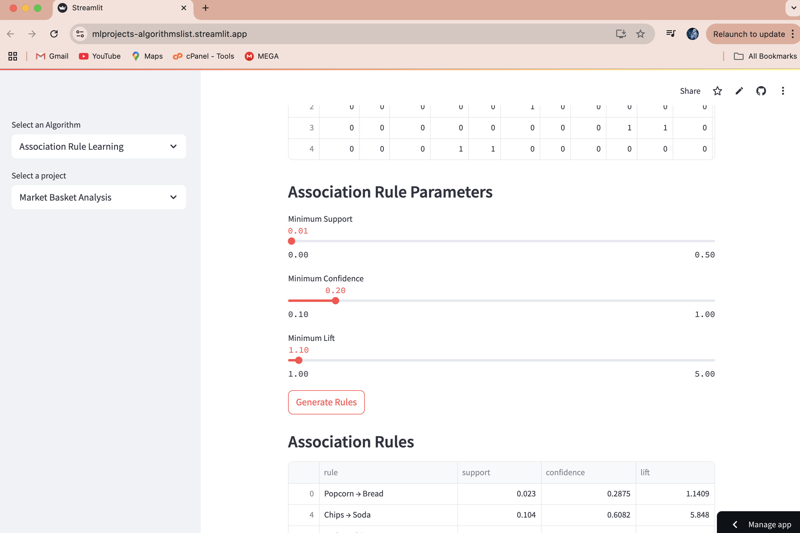
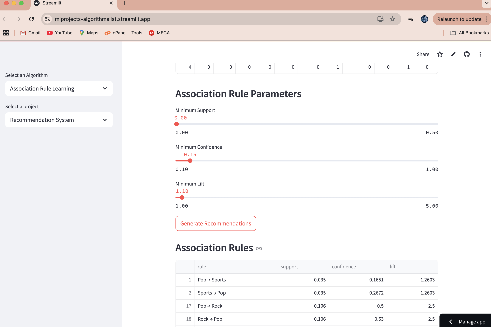

# Association Rule Learning Projects

This repository contains projects that demonstrate the application of Association Rule Learning algorithms in various domains.

## Projects

### 1. Market Basket Analysis

**Screenshots:**

- Interactive transaction data upload
- Customizable support, confidence, and lift thresholds
- Visualization of association rules
- Network visualization of item relationships
- Top rules analysis
- Support vs Confidence scatter plot

### 2. Recommendation System

**Screenshots:**

- Interactive user-item interaction data upload
- Customizable support, confidence, and lift thresholds
- Visualization of item relationships
- Network visualization of item connections
- Personalized recommendations based on selected items
- Rule-based item suggestions

### 3. Feature Selection

**Screenshots:**

- Association rule-based feature selection
- Interactive parameter tuning
- Rule visualization
- Feature importance analysis

### 4. Image Compression

**Screenshots:**

- Association rule-based image compression
- Visualization of compressed vs. original image
- Parameter tuning
- Compression ratio analysis

## How to Run

1. Install the required packages:
```bash
pip install -r requirements.txt
```

2. Run the Streamlit app:
```bash
streamlit run main.py
```

## Project Structure

- `main.py`: Main entry point for running the projects
- `Association_Rule_Learning_projects/`: Directory containing individual project files
  - `market_basket_analysis.py`: Market basket analysis using association rules
  - `recommendation_system.py`: Recommendation system using association rules

## Features

- Interactive parameter tuning
- Rich visualizations using Plotly and NetworkX
- Support for custom data upload
- Sample data generation
- Detailed analysis tools
- Interactive recommendation capabilities

## Contributing

Contributions are welcome! Please feel free to submit a Pull Request.

## License

This project is licensed under the MIT License. 