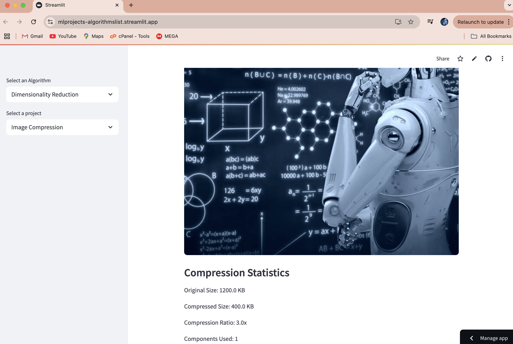
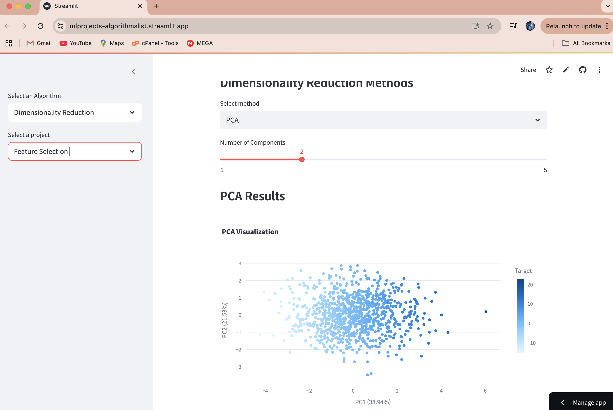

# Dimensionality Reduction Projects

This repository contains projects that demonstrate the application of various dimensionality reduction techniques in different domains.

## Projects

### 1. Image Compression

**Screenshots:**

- Interactive image upload and processing
- PCA-based image compression
- Adjustable number of components
- Compression statistics and analysis
- Explained variance visualization
- Color channel analysis
- Download compressed images

### 2. Feature Selection

**Screenshots:**

- Interactive dataset upload
- Multiple dimensionality reduction methods (PCA, t-SNE)
- Feature importance analysis
- Explained variance visualization
- Interactive parameter tuning
- Correlation analysis
- Visual exploration of reduced dimensions

## How to Run

1. Install the required packages:
```bash
pip install -r requirements.txt
```

2. Run the Streamlit app:
```bash
streamlit run main.py
```

## Project Structure

- `main.py`: Main entry point for running the projects
- `Dimensionality_Reduction_projects/`: Directory containing individual project files
  - `image_compression.py`: Image compression using PCA
  - `feature_selection.py`: Feature selection using PCA and t-SNE

## Features

- Interactive parameter tuning
- Rich visualizations using Plotly
- Support for custom data upload
- Sample data generation
- Detailed analysis tools
- Multiple dimensionality reduction methods
- Comprehensive visualizations

## Contributing

Contributions are welcome! Please feel free to submit a Pull Request.

## License

This project is licensed under the MIT License. 