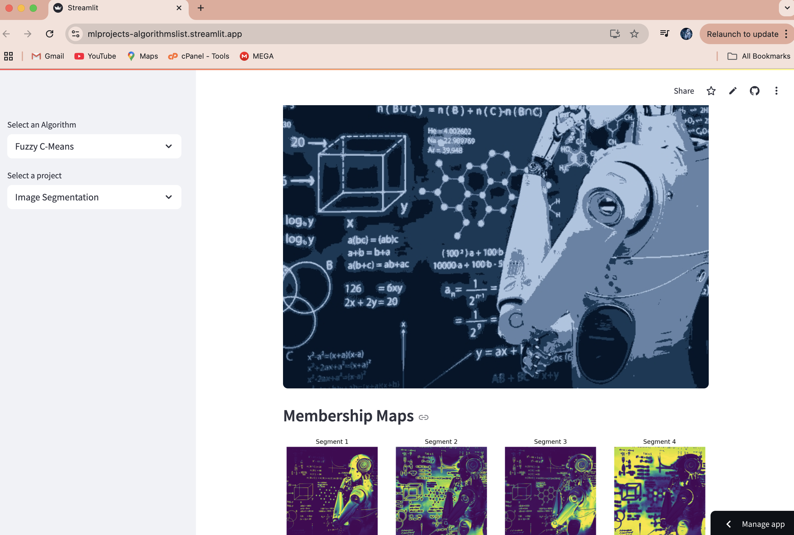
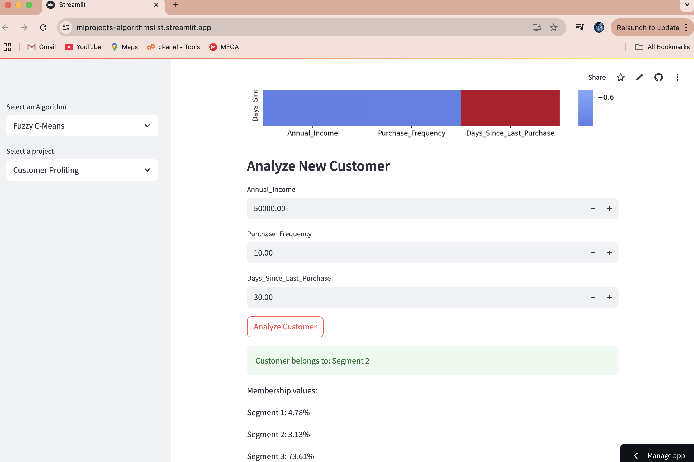

# Fuzzy C-Means Projects

This repository contains projects that demonstrate the application of Fuzzy C-Means clustering algorithm in various domains.

## Projects

### 1. Image Segmentation

**Screenshots:**

- Interactive image upload and processing
- Customizable number of segments
- Adjustable fuzziness parameter
- Visualization of membership maps
- Segment statistics and analysis
- Color distribution analysis

### 2. Customer Profiling

**Screenshots:**

- Interactive feature selection
- Dynamic cluster number adjustment
- Adjustable fuzziness parameter
- PCA visualization with hover data
- Detailed segment analysis
- Feature importance visualization
- Correlation heatmap
- Interactive prediction for new customers

## How to Run

1. Install the required packages:
```bash
pip install -r requirements.txt
```

2. Run the Streamlit app:
```bash
streamlit run main.py
```

## Project Structure

- `main.py`: Main entry point for running the projects
- `Fuzzy_C_Means_projects/`: Directory containing individual project files
  - `image_segmentation.py`: Image segmentation using Fuzzy C-Means
  - `customer_profiling.py`: Customer profiling using Fuzzy C-Means

## Features

- Interactive parameter tuning
- Rich visualizations using Plotly
- Support for custom data upload
- Sample data generation
- Detailed analysis tools
- Interactive prediction capabilities

## Contributing

Contributions are welcome! Please feel free to submit a Pull Request.

## License

This project is licensed under the MIT License. 