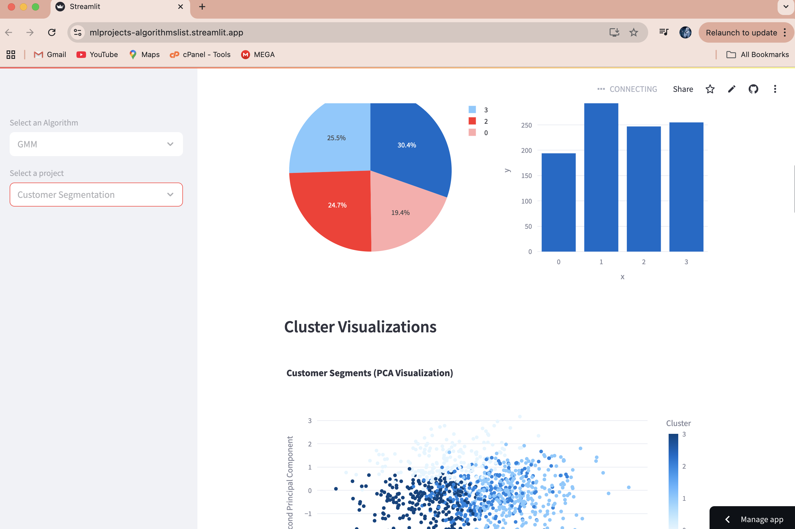

# GMM Projects

This folder contains various projects that utilize Gaussian Mixture Models (GMM) for different applications. Each project is designed to demonstrate the use of GMM in machine learning tasks with interactive visualizations.

## Projects

1. **Customer Segmentation**: Clusters customers based on their characteristics using GMM. Features include:

   **Screenshots:**
   
   - Interactive parameter tuning
   - 2D and 3D visualizations
   - Cluster analysis and interpretation
   - Model evaluation metrics

2. **Image Color Segmentation**: Segments images into color clusters using GMM. Features include:

   **Screenshots:**
   
   - Interactive image upload
   - Color cluster visualization
   - 3D color space analysis
   - Cluster information and statistics

## How to Run

To run any of the projects, follow these steps:

1. Ensure you have the required dependencies installed. You can install them using pip:

   ```bash
   pip install streamlit pandas numpy scikit-learn plotly pillow
   ```

2. Navigate to the GMM directory in your terminal.

3. Run the Streamlit app using the following command:

   ```bash
   streamlit run main.py
   ```

4. Use the sidebar to select the project you want to run.

## Project Structure

- `main.py`: The main entry point for running the projects.
- `GMM_projects/`: Contains individual project files:
  - `customer_segmentation.py`: Customer segmentation project.
  - `image_color_segmentation.py`: Image color segmentation project.

## Features

- Interactive parameter tuning
- Real-time visualizations
- Model evaluation metrics
- Detailed cluster analysis
- Support for custom data input

## Contributing

Feel free to contribute to these projects by submitting pull requests or opening issues for any bugs or feature requests.

## License

This project is licensed under the MIT License - see the LICENSE file for details.
