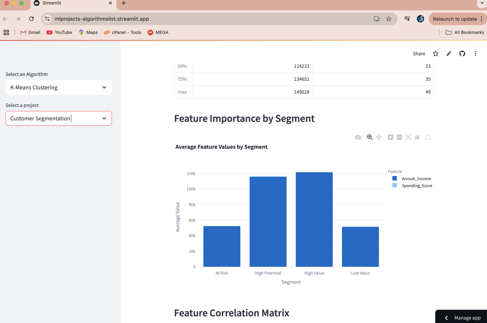
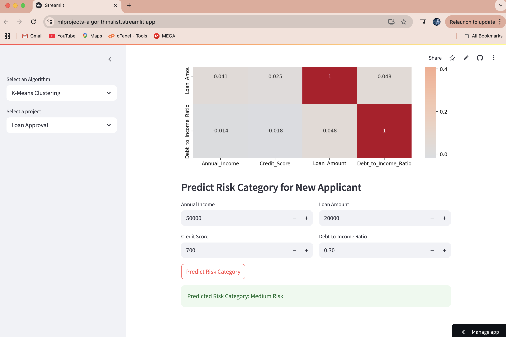

# K-Means Projects

This repository contains various K-Means clustering projects implemented in Python. Each project demonstrates the application of K-Means clustering to solve real-world problems using datasets.

## Project Structure

```
K-Means/
├── main.py
├── requirements.txt
├── K_Means_projects/
│   ├── customer_segmentation.py
│   ├── loan_approval.py
```

### Key Files
- **`main.py`**: The main entry point for running the Streamlit app.
- **`requirements.txt`**: Contains the dependencies required to run the project.
- **`K_Means_projects/`**: Contains individual project scripts.

## Projects Included

1. **Customer Segmentation**  
   Segments customers into different groups based on their behavior and characteristics using K-Means clustering.

   **Screenshots:**
   

   - Interactive parameter tuning
   - Cluster visualization
   - Customer group analysis

2. **Loan Approval Clustering**  
   Groups loan applications into clusters based on various features using K-Means clustering.

   **Screenshots:**
   

   - Risk assessment
   - Cluster analysis
   - Interactive visualization

## How to Run

1. Clone the repository:
   ```bash
   git clone https://github.com/benasphy/ML_projects.git
   cd K-Means
   ```

2. Install dependencies:
   ```bash
   pip install -r requirements.txt
   ```

3. Run the Streamlit app:
   ```bash
   streamlit run main.py
   ```

4. Select a project from the sidebar to explore its functionality.

## Requirements

The project requires the following Python libraries:
- `streamlit`
- `numpy`
- `pandas`
- `scikit-learn`
- `matplotlib`
- `plotly`

## Datasets

- **`customer_data.csv`**: Contains customer behavior data for segmentation.
- **`loan_data.csv`**: Contains loan application data for clustering.

## License

This project is licensed under the MIT License. See the [LICENSE](LICENSE) file for details.

## Acknowledgments

- Datasets used in this project are sourced from publicly available repositories.
- Special thanks to the contributors of the Python libraries used in this project.

---
Feel free to contribute to this repository by submitting issues or pull requests.
