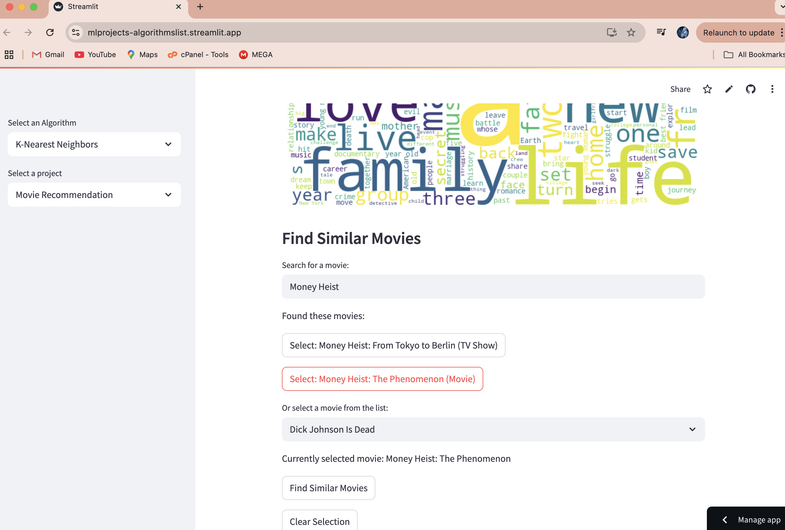
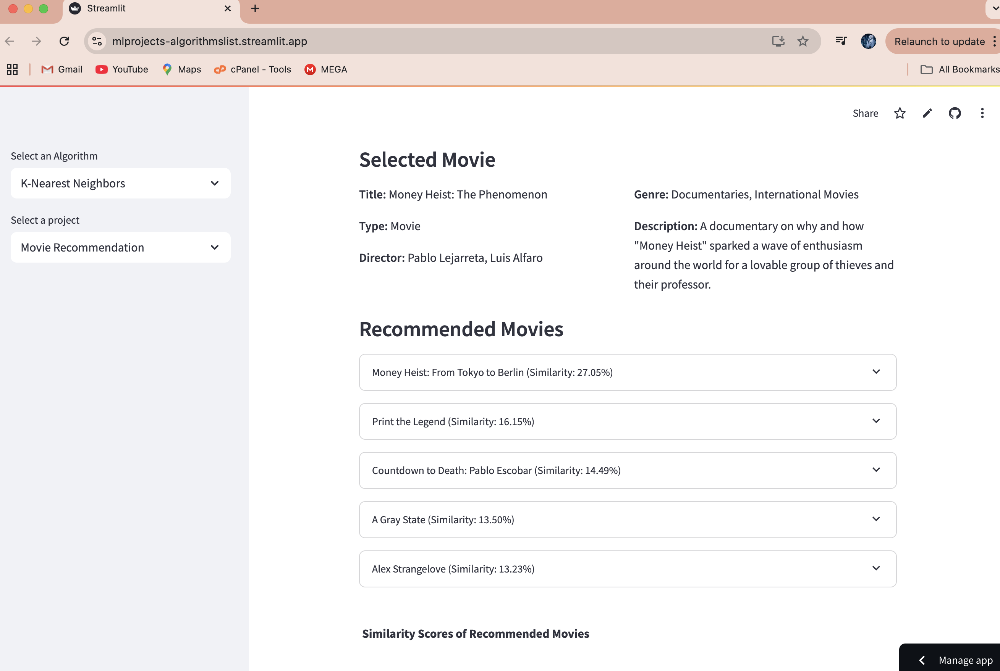
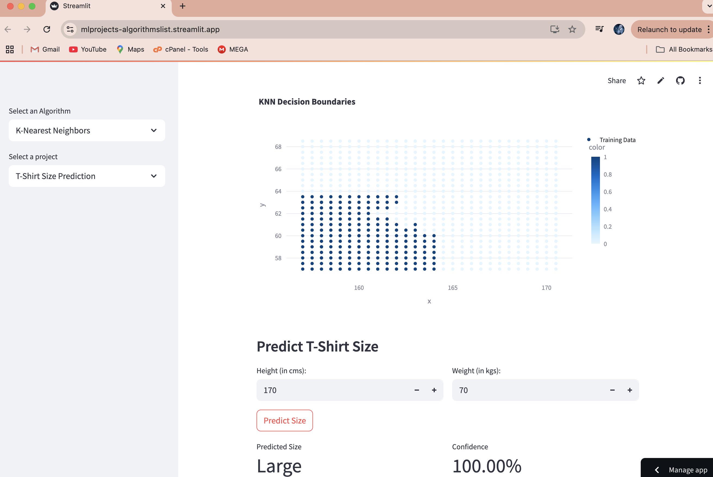

# KNN Projects

This folder contains various projects that utilize the K-Nearest Neighbors (KNN) algorithm for different applications. Each project is designed to demonstrate the use of KNN in machine learning tasks.

## Projects

1. **Movie Recommendation System**: Recommends similar movies based on content features using KNN.

   **Screenshots:**
   
   
2. **T-Shirt Size Prediction**: Predicts T-shirt sizes based on height and weight measurements using KNN.

   **Screenshots:**
   

## How to Run

To run any of the projects, follow these steps:

1. Ensure you have the required dependencies installed. You can install them using pip:

   ```bash
   pip install streamlit pandas numpy scikit-learn
   ```

2. Navigate to the KNN directory in your terminal.

3. Run the Streamlit app using the following command:

   ```bash
   streamlit run main.py
   ```

4. Use the sidebar to select the project you want to run.

## Project Structure

- `main.py`: The main entry point for running the projects.
- `KNN_projects/`: Contains individual project files:
  - `movie_recommendation.py`: Movie recommendation system project.
  - `tshirt_size_prediction.py`: T-shirt size prediction project.

## Data

Each project uses its own dataset, which is either uploaded by the user or loaded from a default CSV file located in the `KNN_projects/` directory.

## Contributing

Feel free to contribute to these projects by submitting pull requests or opening issues for any bugs or feature requests.

## License

This project is licensed under the MIT License - see the LICENSE file for details.
