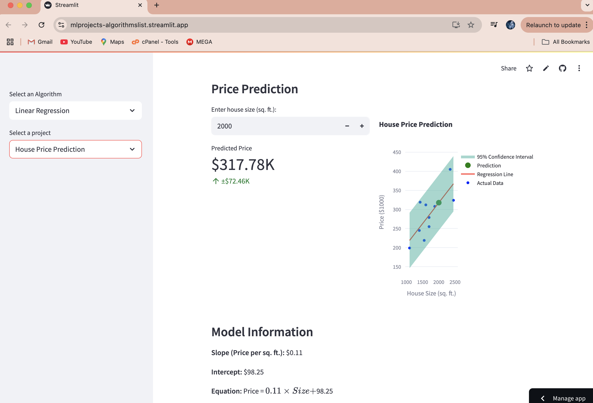

# Linear Regression Projects

This repository contains various Linear Regression projects implemented in Python. Each project demonstrates the application of Linear Regression to solve real-world problems using datasets.

## Project Structure

```
LinearRegression/
├── main.py
├── requirements.txt
├── Linear_regression_projects/
│   ├── messi_goal_prediction.py
│   ├── house_price_prediction.py
│   ├── study_hours_exam_prediction.py
│   ├── normal_equation_vs_gradient_descent.py
│   ├── salary_prediction.py
│   ├── diabetes.csv
```

### Key Files
- **`main.py`**: The main entry point for running the Streamlit app.
- **`requirements.txt`**: Contains the dependencies required to run the project.
- **`Linear_regression_projects/`**: Contains individual project scripts and datasets.

## Projects Included

1. **Messi Goal Prediction**  
   Predicts the number of goals Messi will score based on the number of matches played using Linear Regression.

   **Screenshots:**
   
   
   

2. **House Price Prediction**  
   Predicts house prices based on their sizes using Linear Regression.

   **Screenshots:**
   

3. **Study Hours and Exam Prediction**  
   Predicts exam scores based on the number of hours studied using Linear Regression.

4. **Normal Equation vs Gradient Descent**  
   Compares the performance of the normal equation and gradient descent methods for solving linear regression.

5. **Salary Prediction**  
   Predicts salary based on years of experience using Linear Regression.
