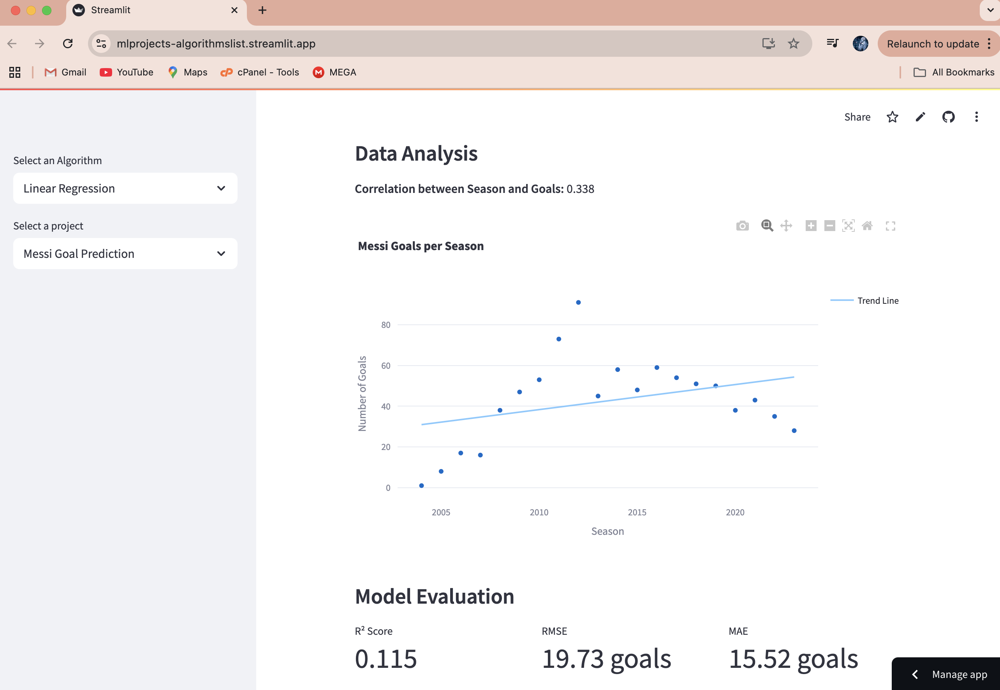

```markdown
# Linear Regression Projects

This repository contains various Linear Regression projects implemented in Python. Each project demonstrates the application of Linear Regression to solve real-world problems using datasets.

## Project Structure

```
LinearRegression/
├── main.py
├── requirements.txt
├── Linear_regression_projects/
│   ├── messi_goal_prediction.py
│   ├── house_price_prediction.py
│   ├── study_hours_exam_prediction.py
│   ├── normal_equation_vs_gradient_descent.py
│   ├── salary_prediction.py
│   ├── diabetes.csv
```

### Key Files
- **`main.py`**: The main entry point for running the Streamlit app.
- **`requirements.txt`**: Contains the dependencies required to run the project.
- **`Linear_regression_projects/`**: Contains individual project scripts and datasets.

## Projects Included

1. **Messi Goal Prediction**  
   A data-driven approach to predict Lionel Messi's goal-scoring performance using Linear Regression.

   **Key Features:**
   - Uses historical match and goal data
   - Demonstrates linear relationship between matches played and goals scored
   - Provides insights into Messi's goal-scoring consistency

   **Screenshots:**
   
   
   

2. **House Price Prediction**  
   Predicts house prices based on their sizes using Linear Regression.

3. **Study Hours and Exam Prediction**  
   Predicts exam scores based on the number of hours studied using Linear Regression.

4. **Normal Equation vs Gradient Descent**  
   Compares the performance of the Normal Equation and Gradient Descent methods for solving Linear Regression problems.

5. **Salary Prediction**  
   Predicts salaries based on years of experience using Linear Regression.

## How to Run

1. Clone the repository:
   ```bash
   git clone https://github.com/benasphy/ML_projects.git
   cd LinearRegression
   ```

2. Install dependencies:
   ```bash
   pip install -r requirements.txt
   ```

3. Run the Streamlit app:
   ```bash
   streamlit run main.py
   ```

4. Select a project from the sidebar to explore its functionality.

## Requirements

The project requires the following Python libraries:
- `streamlit`
- `numpy`
- `pandas`
- `scikit-learn`
- `matplotlib`

## Datasets

- **`diabetes.csv`**: Contains data for predicting diabetes outcomes based on various health metrics.


## License

This project is licensed under the MIT License. See the [LICENSE](LICENSE) file for details.

## Acknowledgments

- Datasets used in this project are sourced from publicly available repositories.


---
Feel free to contribute to this repository by submitting issues or pull requests.
```
