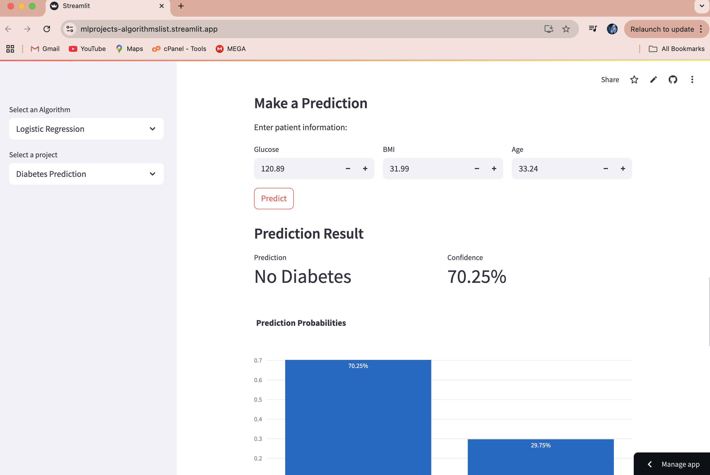
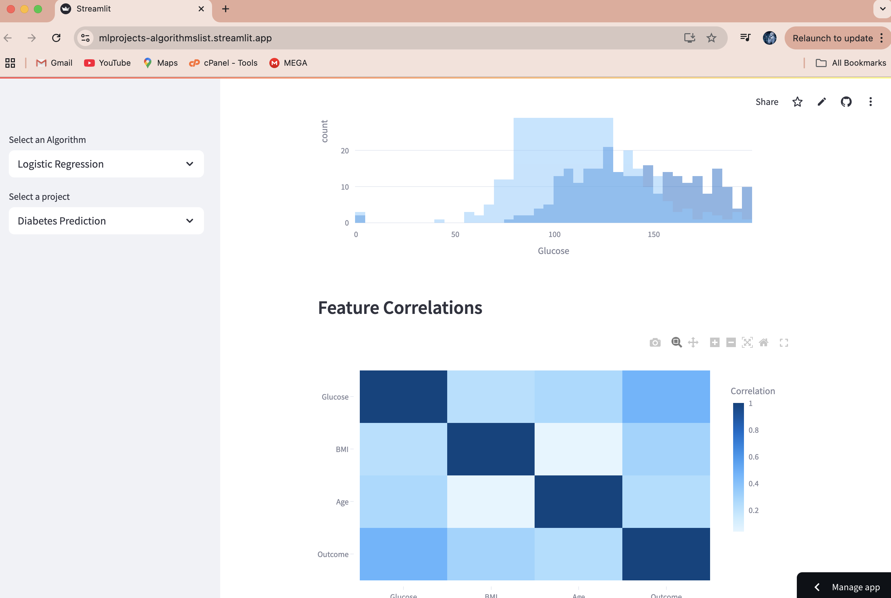
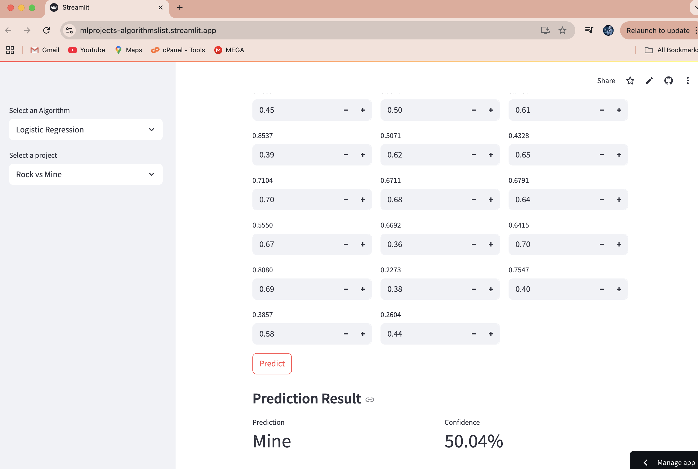
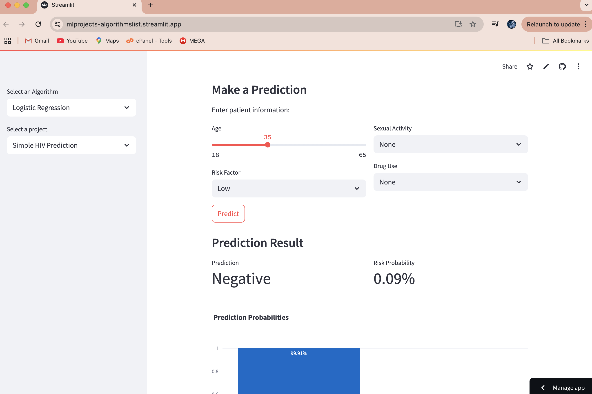

```markdown
# Logistic Regression Projects

This repository contains various Logistic Regression projects implemented in Python. Each project demonstrates the application of Logistic Regression to solve real-world problems using datasets.

## Project Structure

```
Logistic_Regression/
├── main.py
├── requirements.txt
├── Logistic_regression_projects/
│   ├── diabetes_prediction.py
│   ├── rock_vs_mine.py
│   ├── simple_hiv_prediction.py
│   ├── diabetes.csv
│   ├── sonar.csv
```

### Key Files
- **`main.py`**: The main entry point for running the Streamlit app.
- **`requirements.txt`**: Contains the dependencies required to run the project.
- **`Logistic_regression_projects/`**: Contains individual project scripts and datasets.

## Projects Included

1. **Diabetes Prediction**  
   Predicts the likelihood of diabetes based on health metrics such as glucose level, blood pressure, BMI, etc.  
   Dataset: `diabetes.csv`

   **Screenshots:**
   
   

2. **Rock vs Mine Classification**  
   Classifies sonar signals as either "Rock" or "Mine" using Logistic Regression.  
   Dataset: `sonar.csv`

   **Screenshots:**
   

3. **Simple HIV Prediction**  
   Predicts HIV status based on features like age, CD4 count, and viral load.  
   Dataset: Synthetic data (hardcoded in the script).

   **Screenshots:**
   

## How to Run

1. Clone the repository:
   ```bash
   git clone https://github.com/benasphy/ML_projects.git
   cd Logistic_Regression
   ```

2. Install dependencies:
   ```bash
   pip install -r requirements.txt
   ```

3. Run the Streamlit app:
   ```bash
   streamlit run main.py
   ```

4. Select a project from the sidebar to explore its functionality.

## Requirements

The project requires the following Python libraries:
- `streamlit`
- `numpy`
- `pandas`
- `scikit-learn`

## Datasets

- **`diabetes.csv`**: Contains data for predicting diabetes outcomes based on various health metrics.
- **`sonar.csv`**: Contains sonar data for classification tasks.

## Screenshots

Add screenshots of the Streamlit app interface here to showcase the projects.

## License

This project is licensed under the MIT License. See the [LICENSE](LICENSE) file for details.

## Acknowledgments

- Datasets used in this project are sourced from publicly available repositories.
- Special thanks to the contributors of the Python libraries used in this project.

---
Feel free to contribute to this repository by submitting issues or pull requests.```

### Steps to Save:
1. Save this content as `README.md` in the `Logistic_Regression` folder.
2. Ensure the project structure matches the one described in the `README.md`.
