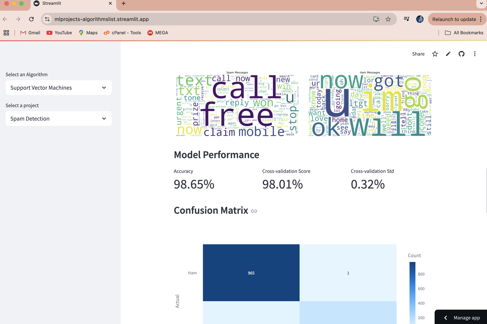
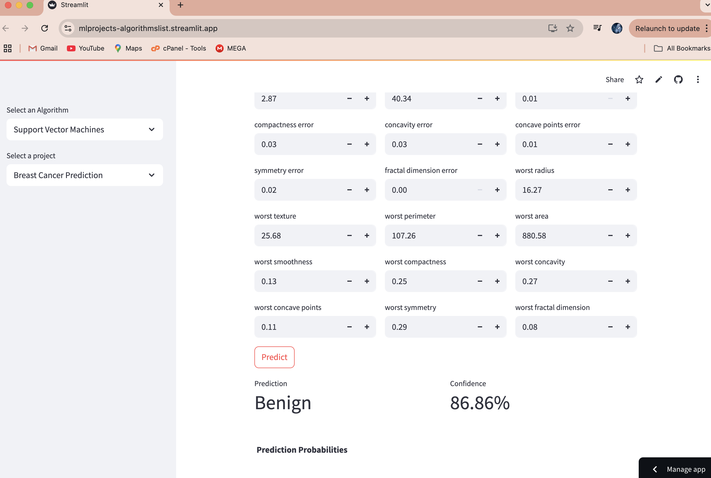

# SVM Projects

This folder contains various projects that utilize the Support Vector Machine (SVM) algorithm for different applications. Each project is designed to demonstrate the use of SVM in machine learning tasks.

## Projects

1. **Spam Detection**: Classifies emails as spam or not spam using SVM.

   **Screenshots:**
   
2. **Breast Cancer Prediction**: Predicts whether a breast cancer tumor is benign or malignant using SVM.

   **Screenshots:**
   

## How to Run

To run any of the projects, follow these steps:

1. Ensure you have the required dependencies installed. You can install them using pip:

   ```bash
   pip install streamlit pandas numpy scikit-learn
   ```

2. Navigate to the SVM directory in your terminal.

3. Run the Streamlit app using the following command:

   ```bash
   streamlit run main.py
   ```

4. Use the sidebar to select the project you want to run.

## Project Structure

- `main.py`: The main entry point for running the projects.
- `SVM_projects/`: Contains individual project files:
  - `spam_detection.py`: Spam detection project.
  - `breast_cancer_prediction.py`: Breast cancer prediction project.

## Data

- The spam detection project uses the spam.csv dataset
- The breast cancer prediction project uses the built-in breast cancer dataset from scikit-learn

## Contributing

Feel free to contribute to these projects by submitting pull requests or opening issues for any bugs or feature requests.

## License

This project is licensed under the MIT License - see the LICENSE file for details.
